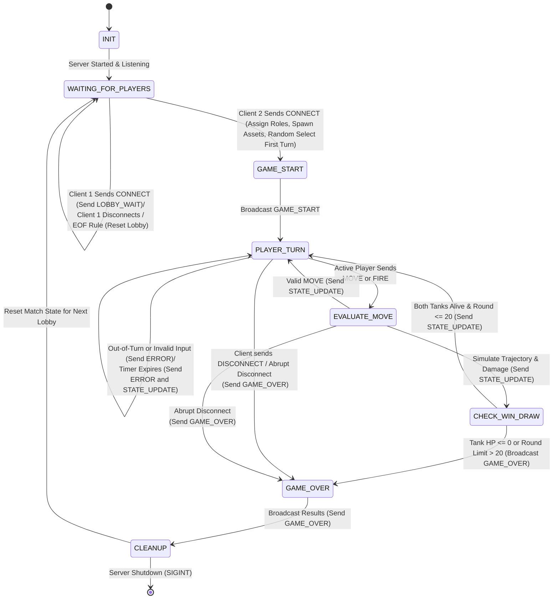

# TANKSCII : Statement of Work & Protocol Specification

**Student Name :** Ethan Sheffield  
**Date :** 2026-09-20
**Course :** CS 457 - Computer Networks  
**Target Server Domain :** `server.sheffield.edu`  

---

## 1. Game Selection & Scope (Sprint 0)

### 1.1 Game Overview
- **Chosen Game :** 
  - Tankscii : Terminal Artillery
- **Player Capacity :** 
  - 2 Players (Simulated via 2 CML Client nodes)
- **Game Summary :** 
  - Tankscii is a turn-based tactical artillery game where players take turns inputting firing angles and power levels to launch projectiles across a 2D ASCII terrain. The last surviving tank with health remaining wins the match.

### 1.2 Core Game Rules & Win/Draw Conditions
- **Turn Mechanics :** 
  - Each player will have a 30-second move timer, enforced by a server-side round-robin state machine. 
  - At the start of each turn, a player can optionally move left or right by a range of 1-5 units. Next, the player inputs a launch angle and power to fire a projectile.
  - Projectiles will create a crater if in lands within the rendered display dimensions.
  - Damage is calculated in two categories. 
    1) Direct Hit : The projectile strikes the opponent tank directly, causing 25 hp of damage.
    2) Shrapnel Hit : If the tank is within 2 distance units of where the projectile strikes, it causes 10 hp of damage. 
  - Out-of-turn commands will be rejected by the server and if a player's time expires, the turn will pass to the next player.

- **Victory Conditions :** 
  1) A player wins if their opponent's health is reduced to 0HP while they maintain a health value greater than 0HP.
  2) The opposing player forfeits.
  3) The opposing player gracefully closes their TCP connection.
  4) The opposing player's Client abruptly disconnects or the socket times out.
   
- **Draw/Tie Condition :** 
  - Either both players health is reduced to 0HP in the same turn or both players have a health value greater than 0HP when a 20-round limit expires.

---

## 2. Application-Layer Messaging Protocol Blueprint

### 2.1 Message Transport & Serialization Format
- **Transport Protocol :** TCP
- **Serialization Format :** Compact UTF-8 JSON
- **Framing Mechanism :** Newline-delimited (`\n` / `0x0A`) JSON payloads
- **Receiver Buffer & Boundary Handling :** 
  - Receivers maintain a stream accumulator buffer for incoming chunks.
  - Scans for delimiter `\n` to extract complete frames and retain trailing bytes, resolving TCP stream fragmentation and coalescing.

### 2.2 Message Schema Definitions

- **Frame Header Fields :**
  - `msg_type` : Identifies the operation (`str`).
  - `player_id` : Identifies the sender (`Player_1`, `Player_2`, or `SERVER`).
  - `timestamp` : UNIX epoch timestamp (`int`).
  - `payload` : Dictionary containing message-specific parameters.

- **Message Types :**
  1. `CONNECT` (Client -> Server): Request to join game room with player nickname (1–16 chars) and SemVer string (`client_version`).
  2. `LOBBY_WAIT` (Server -> Client): Notification to Client 1 that server is waiting for Player 2 to connect (`assigned_id: "Player_1"`).
  3. `GAME_START` (Server -> Clients): Server notifies both clients that game has started, assigns roles, spawns terrain and tanks (`Player_1` at x=10, `Player_2` at x=70, 100 HP), and designates `first_turn`.
  4. `MOVE` (Client -> Server): Active player optionally submits repositioning direction (`LEFT` or `RIGHT`) and distance (1–5 units; max 1 per turn).
  5. `FIRE` (Client -> Server): Active player submits launch angle (0°–180°) and launch power (1%–100%).
  6. `STATE_UPDATE` (Server -> Clients): Server broadcasts updated round (1–20), action (`MOVE`, `FIRE`, or `TIMEOUT`), tank positions/HP, trajectory coordinates, impact point, crater list, and remaining turn timer.
  7. `ERROR` (Server -> Client): Server notifies client of out-of-turn actions (`OUT_OF_TURN`), invalid parameters (`INVALID_PARAMS`), repeated move (`MOVE_ALREADY_USED`), or timeout (`TIMEOUT`).
  8. `DISCONNECT` (Client -> Server): Client notifies server of intentional departure or forfeit (`FORFEIT` or `USER_QUIT`).
  9. `GAME_OVER` (Server -> Clients): Server broadcasts final outcome (winner, reason: `HP_ELIMINATION`, `ROUND_LIMIT`, `FORFEIT`, or `DISCONNECT`), final scores, and summary message.

#### Example JSON Protocol Schema:

- **Client Action (`MOVE`) :**
```json
{
  "msg_type": "MOVE",
  "player_id": "Player_1",
  "payload": {
    "direction": "RIGHT",
    "distance": 3
  },
  "timestamp": 1727000005
}
```

---

### 2.3 Game State Machine (FSM) Design (Sprint 1 Deliverable)

- **State Machine Flow :**
  - `INIT` -> `WAITING_FOR_PLAYERS` -> `GAME_START` -> `PLAYER_TURN` -> `EVALUATE_MOVE` -> `CHECK_WIN_DRAW` -> `GAME_OVER` -> `CLEANUP`.



---

## 3. Game Behavior & Server Concurrency Architecture (Sprint 2 Deliverable)

### 3.1 Server Concurrency Strategy
- **Architecture Choice:** [Multi-Threading (`threading.Thread`) OR Non-blocking I/O multiplexing (`select.select` / `selectors`)]
- **Synchronization Logic:** Explain how shared game state and client list are thread-safe (e.g. `threading.Lock`) to prevent race conditions during turn processing.

### 3.2 State & Score Synchronization Across Clients
- **Turn Enforcement:** Detail how the server validates active player ID before processing moves and broadcasts updated turn notifications to all clients.
- **Score & Board Synchronization:** Describe how state broadcasts keep client screens synchronized in real time.

---

## 4. Coding & AI Implementation Plan (Sprint 3)

- **Permitted AI Tools:** [e.g., GitHub Copilot, ChatGPT, Claude]
- **AI Prompting & Constraint Strategy:** Explain how you will constrain AI models to generate code (in Python or your chosen language) that adheres strictly to the protocol blueprint and FSM designed in Sprints 1 & 2.
- **Implementation Risk Management:** Detail your plan to leverage past programming experience and manage time to ensure code completion on schedule.

---

## 5. CML Multi-Subnet Topology & Wireshark Deployment Plan (Sprint 4 & 5 Deliverable)

> For now you can use the topology below. We may update this when we get to defining subnets.

### 5.1 Subnet & Router Design
- **Subnet A (Client 1):** `192.168.10.0/24` (Interface `Gi0/1` on Router R1)
- **Subnet B (Client 2):** `192.168.11.0/24` (Interface `Gi0/2` on Router R1)
- **Subnet C (Game Server):** `192.168.20.0/24` (Interface `Gi0/1` on Router R2)
- **Router Backbone:** `10.0.0.0/30` (Interface `Gi0/0` on R1 <-> `Gi0/0` on R2)

### 5.2 DHCP Pools & DNS Configuration Plan
- **Router R1 DHCP Pool 1 (`CLIENT1_POOL`):** Leases `192.168.10.10` - `192.168.10.50`, gateway `192.168.10.1`, DNS `10.0.0.2`.
- **Router R1 DHCP Pool 2 (`CLIENT2_POOL`):** Leases `192.168.11.10` - `192.168.11.50`, gateway `192.168.11.1`, DNS `10.0.0.2`.
- **Router R2 Authoritative DNS:** Configured with `ip dns server` and static host mapping `server.[yourlastname].edu` -> `192.168.20.100`.

### 5.3 Deployment Strategy & Wireshark Trace Capture
- **CML Deployment Strategy:** Deploy `server.py` onto Subnet C node (`192.168.20.100`) behind Router R2, and `client.py` onto Subnet A and Subnet B nodes behind Router R1.
- **Cisco Infrastructure Configuration:** Router R1 DHCP pools (`CLIENT1_POOL`, `CLIENT2_POOL`) and Router R2 authoritative DNS (`ip host server.[lastname].edu 192.168.20.100`).
- **Wireshark Trace Capture Plan:** Capture DHCP DORA exchange (`dhcp_negotiation.pcap`) and DNS query/response resolution (`dns_lookup.pcap`).
