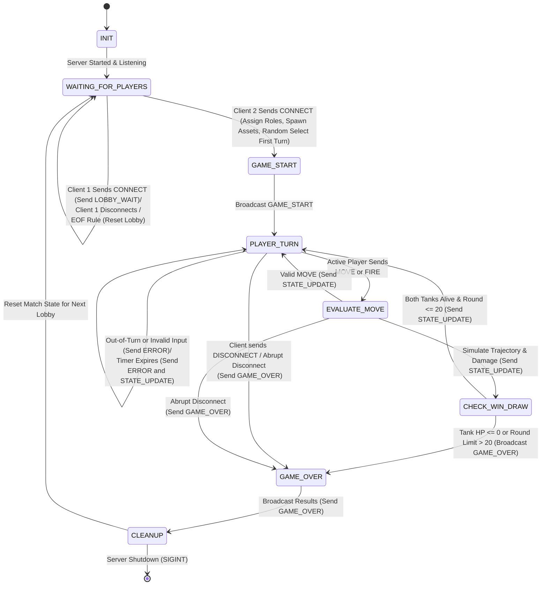

# TANKSCII : Game State Machine (FSM) Specification

**Author :** Ethan Sheffield  
**Date :** 2026-10-04  
**Course :** CS 457 - Computer Networks  
**Target Server Domain :** `server.sheffield.edu`  

---

---

## State Handling Logic & Edge Cases

### 1. Valid Moves
- **Tank Repositioning (`MOVE`):** 
    - The active player may optionally submit one `MOVE` command per turn (`direction: "LEFT" | "RIGHT"`, `distance: 1–5`). The server validates distance limits and terrain bounds, updates tank coordinates, and broadcasts `STATE_UPDATE` (`action: "MOVE"`). The state machine loops back to `PLAYER_TURN` so the active player can aim and fire with their remaining time.
- **Projectile Launch (`FIRE`):** 
    - The active player submits launch values (`angle: 0–180`, `power: 1–100`). State transitions to `EVALUATE_MOVE`, where the server simulates trajectory physics, creates terrain craters, deducts damage (Direct Hit: 25 HP; Shrapnel Hit within 2 units: 10 HP) The server then broadcasts `STATE_UPDATE` (`action: "FIRE"`), and transitions to `CHECK_WIN_DRAW`.

### 2. Invalid Input & Turn Timeouts
- **Out-of-Turn Actions :** 
    - Commands from the inactive player are rejected immediately with `ERROR` (`error_code: "OUT_OF_TURN"`). The active player's turn and timer continue uninterrupted.
- **Illegal Parameters :** 
    - Out-of-bounds firing values, distance > 5, or multiple `MOVE` attempts in a single turn return `ERROR` (`error_code: INVALID_PARAMS or MOVE_ALREADY_USED`) with `retry_allowed: true`. The active player's turn and timer continue uninterrupted.
- **30-Second Turn Timeout :** 
    - If the countdown expires before a shot is fired, the server sends `ERROR` (`error_code: "TIMEOUT", retry_allowed: false`) to the player who did not fire. The server then broadcasts `STATE_UPDATE` (`action: "TIMEOUT", time_remaining: 30`) to hand off the turn to the opponent, and remains in `PLAYER_TURN`.

### 3. Unexpected Client Disconnections & Teardown
- **Exception Trapping :** 
    - Message dispatch loops catch `ConnectionResetError` (TCP RST), `BrokenPipeError` (EPIPE during broadcast), and socket `TimeoutError` without crashing the server process.
- **0-Byte EOF Detection :** 
    - Receive loops evaluate `if not data: break` to detect TCP FIN teardowns and avoid 100% CPU infinite spin loops.
- **Lobby Drop (`WAITING_FOR_PLAYERS`) :** 
    - If Client 1 departs before Client 2 joins, the server reclaims the socket and resets the lobby state.
- **Mid-Game Drop (`PLAYER_TURN`, `EVALUATE_MOVE`) :** 
    - An abrupt drop or `DISCONNECT` frame immediately routes to `GAME_OVER`. The server declares the surviving player the victor by forfeit (`reason: "FORFEIT"` for graceful surrender, `"reason: "DISCONNECT"` for abrupt drop/RST/timeout). Sockets are closed and state transitions to `CLEANUP`.