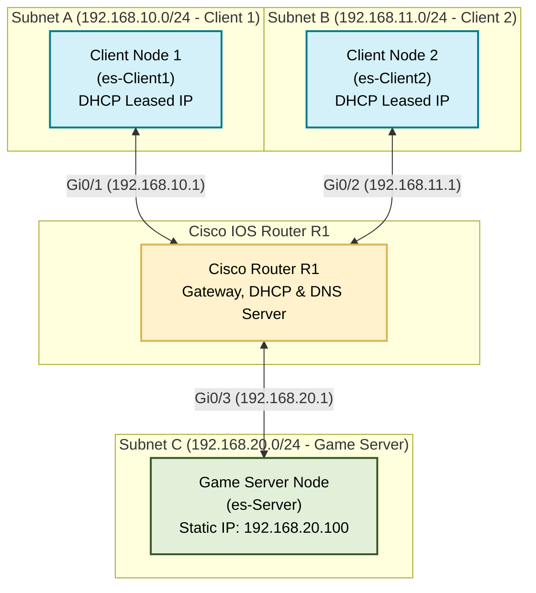

# TANKSCII : CML Network Topology

**Author :** Ethan Sheffield  
**Date :** 2026-11-15  
**Course :** CS 457 - Computer Networks  
**Target Server Domain :** `server.sheffield.edu`  

---

```mermaid
graph TD
    subgraph Subnet_A ["Subnet A (192.168.10.0/24 - Client 1)"]
        Client1["Client Node 1<br>(es-Client1)<br>DHCP Leased IP"]
    end

    subgraph Subnet_B ["Subnet B (192.168.11.0/24 - Client 2)"]
        Client2["Client Node 2<br>(es-Client2)<br>DHCP Leased IP"]
    end

    subgraph Router ["Cisco IOS Router R1"]
        R1["Cisco Router R1<br>Gateway, DHCP & DNS Server"]
    end

    subgraph Subnet_C ["Subnet C (192.168.20.0/24 - Game Server)"]
        ServerNode["Game Server Node<br>(es-Server)<br>Static IP: 192.168.20.100"]
    end

    Client1 <--> |"Gi0/1 (192.168.10.1)"| R1
    Client2 <--> |"Gi0/2 (192.168.11.1)"| R1
    R1 <--> |"Gi0/3 (192.168.20.1)"| ServerNode

    classDef client fill:#d4f1f9,stroke:#007b8b,stroke-width:2px,color:#000000;
    classDef server fill:#e2f0d9,stroke:#385723,stroke-width:2px,color:#000000;
    classDef router fill:#fff2cc,stroke:#d6b656,stroke-width:2px,color:#000000;

    class Client1,Client2 client;
    class ServerNode server;
    class R1 router;
```